# 大观园 · DaGuanYuan

依《红楼梦》原著复原的可漫游 3D 大观园。浏览器里跟着第十七回贾政一行游园，走进潇湘馆、怡红院、秋爽斋，元宵夜看满园灯火。

A walkable 3D reconstruction of the Grand View Garden from *Dream of the Red Chamber*, built with Three.js. The layout, inscriptions and room furnishings follow the novel's text; the look of the buildings follows the garden built in Beijing for the 1987 TV series.

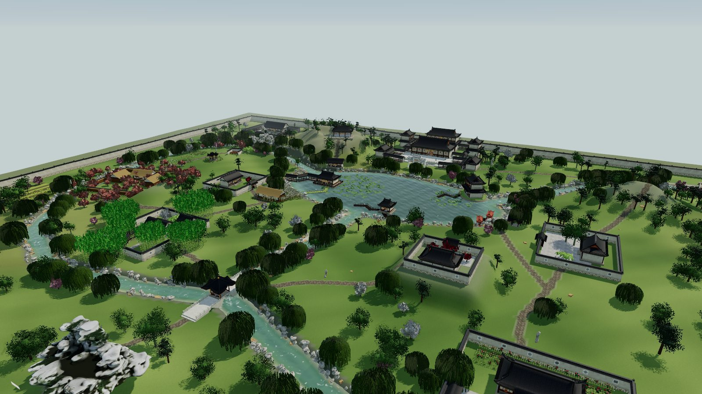

## 经典景致

| | |
|---|---|
| 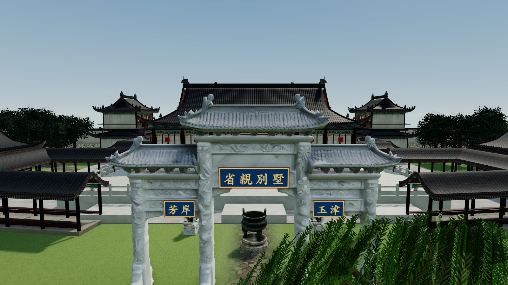 **省亲别墅** 玉石牌坊，元妃命将“天仙宝境”换作“省亲别墅”（第十八回） | 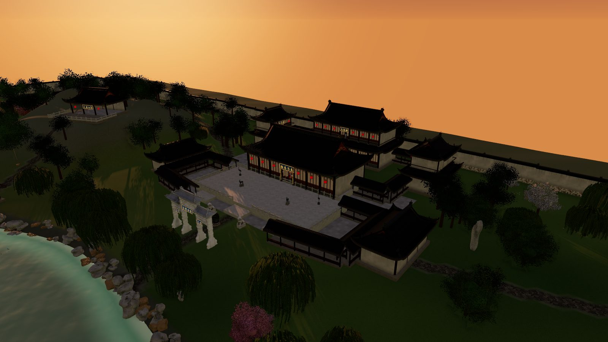 **顾恩思义殿与大观楼** 东缀锦阁、西含芳阁，复道萦纡 |
| 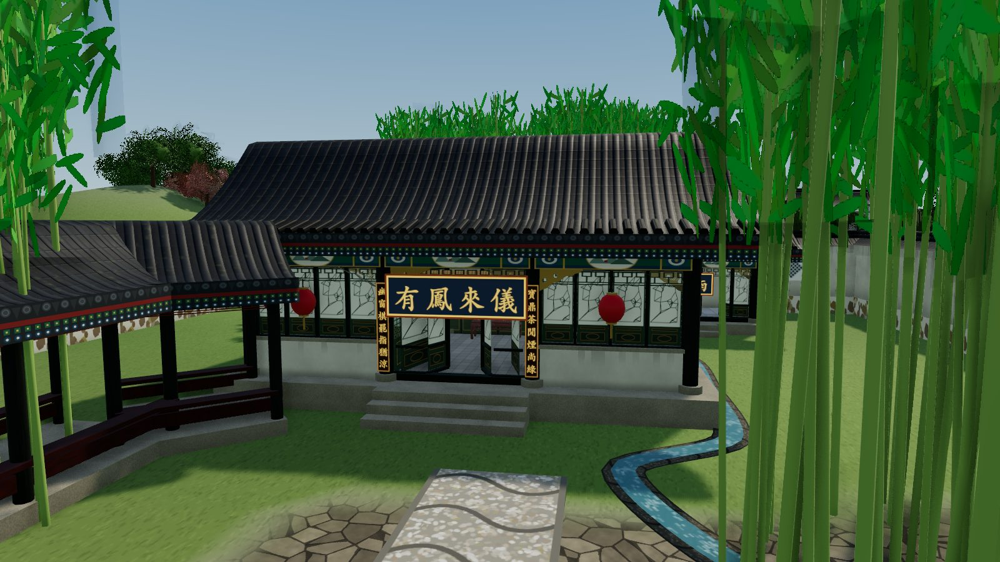 **潇湘馆** “有千百竿翠竹遮映……曲折游廊，阶下石子漫成甬路” | 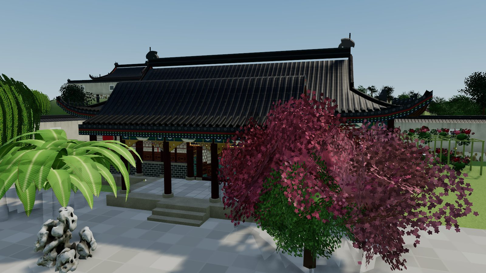 **怡红院** “一边种着数本芭蕉，那一边乃是一棵西府海棠” |
| 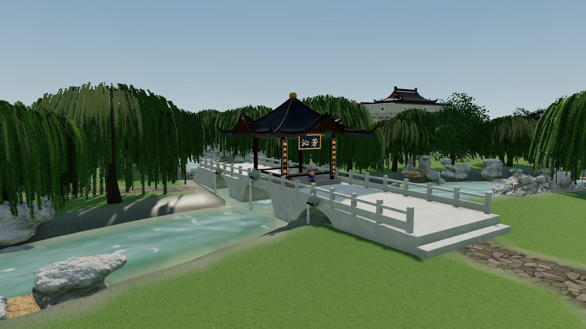 **沁芳亭** “石桥三港，兽面衔吐。桥上有亭” | 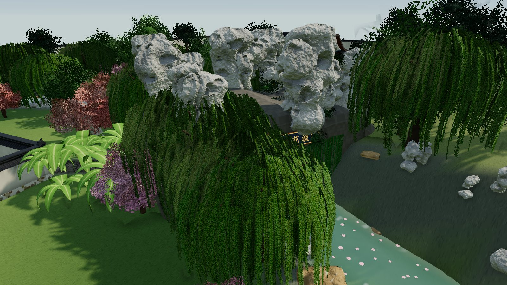 **蓼汀花溆** “忽闻水声潺湲，泻出石洞，上则萝薜倒垂” |
| 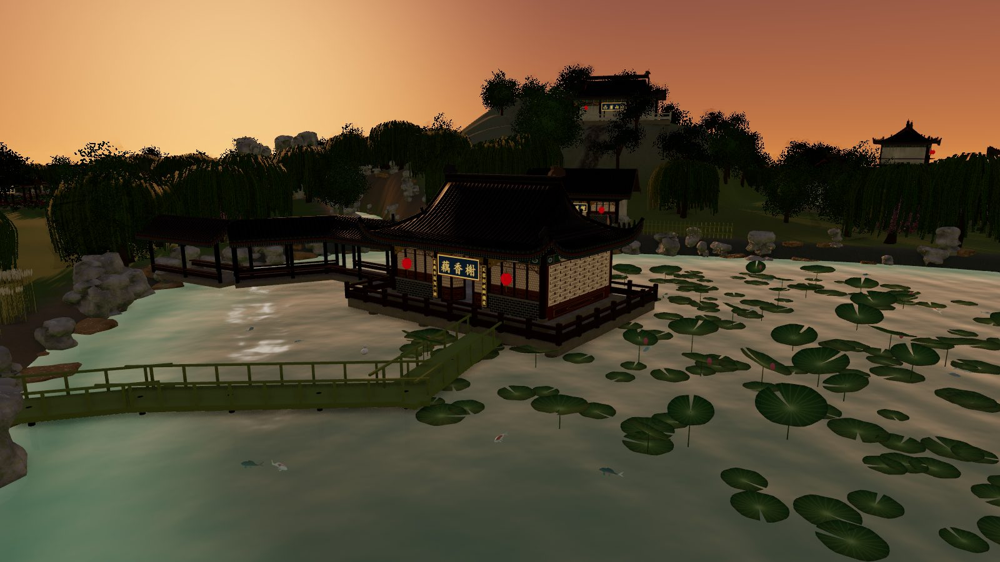 **藕香榭** 盖在池中，四面有窗，曲廊竹桥 | 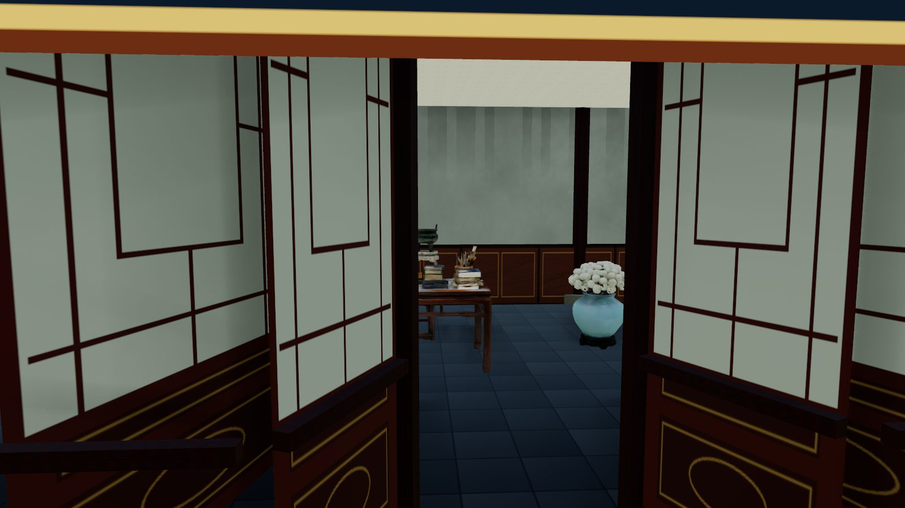 **秋爽斋** 花梨大理石大案、汝窑花囊插白菊（第四十回） |
| 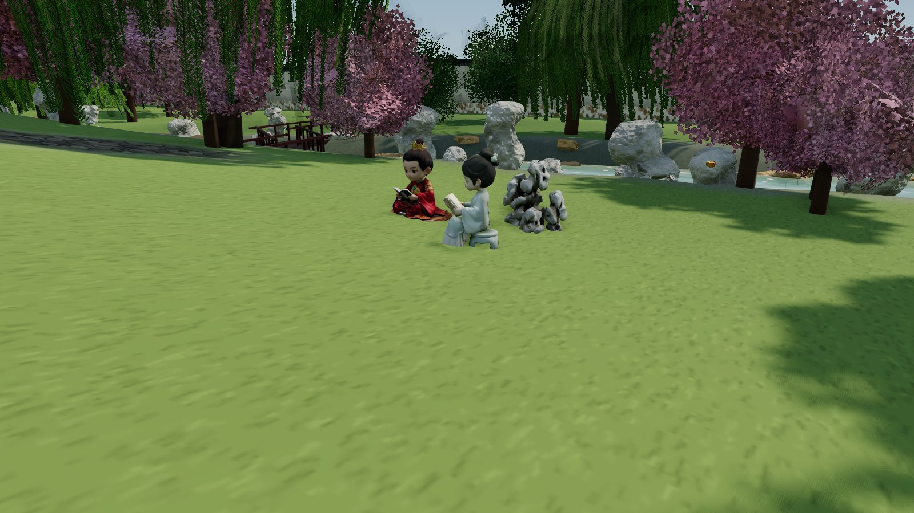 **沁芳闸桥边·宝黛共读**（第二十三回） | 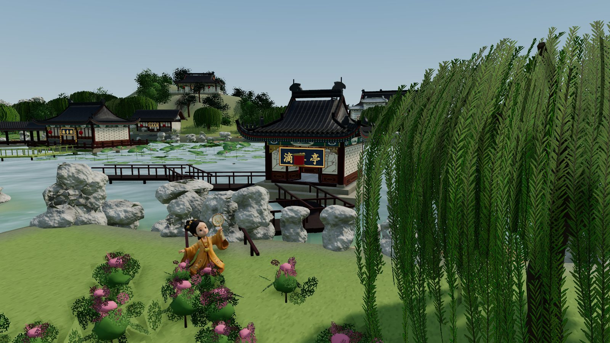 **滴翠亭·宝钗扑蝶**（第二十七回） |

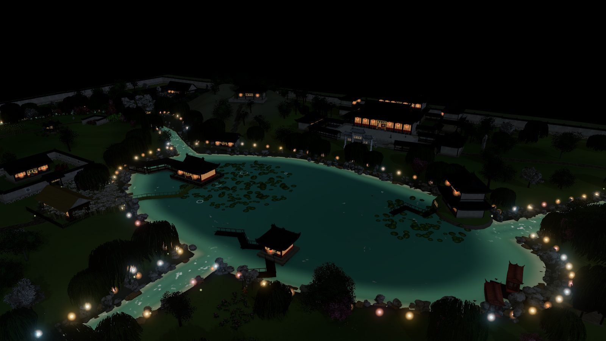
**元宵** “园中香烟缭绕，花彩缤纷，处处灯光相映”（第十八回）

| | |
|---|---|
| 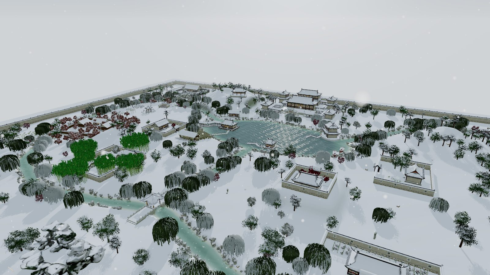 **雪** 琉璃世界白雪红梅（第四十九回） | 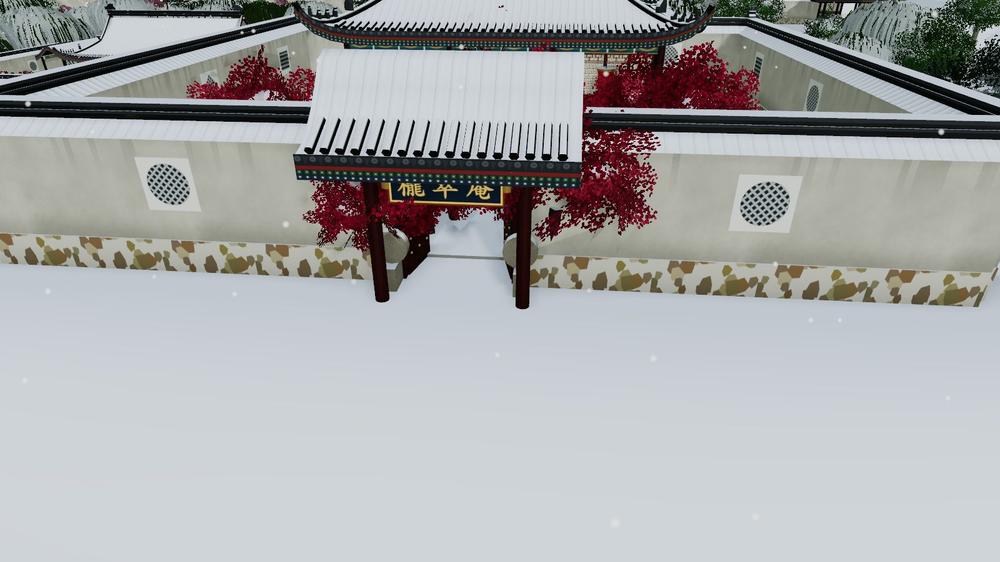 **栊翠庵** “十数株红梅如胭脂一般，映着雪色，分外显得精神” |

## 有什么

- **布局与考据**：以第十七回游园路线为骨架，二十余处景致的方位、匾额、楹联、引文都出自原文（`research/layout.json`，原文在 `research/yuanwen/`）。方位取舍写在每条的 `note` 里。
- **建筑**：程序化清式构件：卷棚/歇山/硬山/攒尖屋顶，筒瓦勾头、正吻走兽、斗拱雀替、和玺/苏式/旋子彩画、五种棂格、粉墙虎皮石、游廊、月洞门、石拱桥。
- **室内**：潇湘馆、秋爽斋、蘅芜苑、怡红院、稻香村、顾恩思义殿，陈设依第十七、十八、四十、四十一回描写（`research/interiors.md`）。
- **自然与动态**：沁芳溪按原著方向流动，沁芳闸跌水；带孔洞的太湖石与湖石驳岸；垂柳、翠竹、杏花、海棠、芭蕉随风摆动；落花、蝴蝶、锦鲤、鹅鸭、萤火。
- **时辰与季节**：昼 / 暮 / 元宵 / 雪 / 月夜。雪景中屋顶、地面积雪，飘雪，红梅不覆雪。
- **玩法**：鸟瞰、第一人称漫步（可进屋）、“贾政游园”自动导览、点击景点看原文、小地图。

## 本地运行

```bash
cd web
npm install
npm run dev        # http://localhost:5173/
npm start          # 构建并预览产物 http://localhost:4173/
```

## 目录

```
research/   原著摘录、layout.json（唯一数据源）、86 版参考笔记 refs.md、室内考据 interiors.md
web/src/    main.js 渲染与交互 · places.js 景点 · arch.js 建筑构件 · interiors.js 室内
            terrain.js / water.js 地形水系 · flora.js 植物 · rocks.js 太湖石 · dynamics.js 动态 · details.js 桥梁驳岸灯海
assets/     AI 道具的提示词与原始模型（scripts/gen_assets.py：概念图 → Tripo image-to-3D）
loop/       真实度迭代框架：视角与清单 config.json、截图对比 run.mjs、每轮流程 PROMPT.md、日志 LOG.md
```

## 真实度迭代（loop engineering）

`node loop/run.mjs` 渲染 32 个固定视角，测帧率、收集报错，生成和上一轮并排对比的报告；`loop/PROMPT.md` 规定每轮只改 3 个权重最高的未满足项，结果写入 `loop/LOG.md`。在 Claude Code 中可用 `/loop 30m 按 loop/PROMPT.md 跑一轮大观园真实度迭代` 持续运行。

## 说明

- 原著前后描写互有出入，这里是一种复原方案，不是定论。
- 1987 年电视剧剧照只作配色和形制参考，没有放进场景。人物为风格化示意模型，不对应任何演员。
- 部分道具、家具和人物模型由 AI 生成（概念图 + Tripo image-to-3D）。

## 许可

代码以 MIT 许可发布，见 [LICENSE](LICENSE)。原文来自维基文库（公有领域）；`research/tv86/` 中的参考照片来自 Wikimedia Commons，按各自的 CC 协议使用，作者见 `research/tv86/SOURCES.md`。
